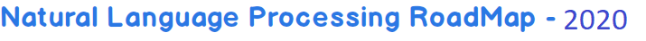
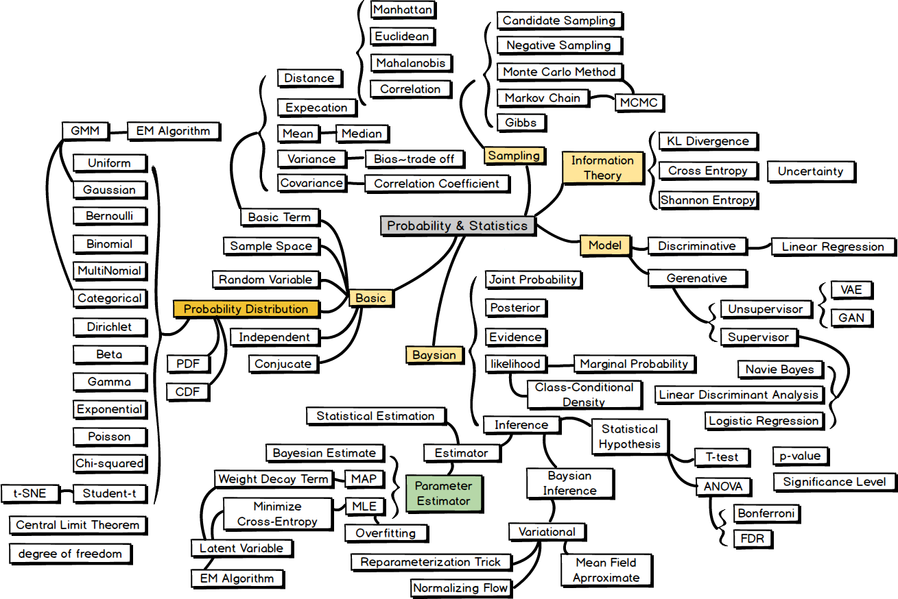
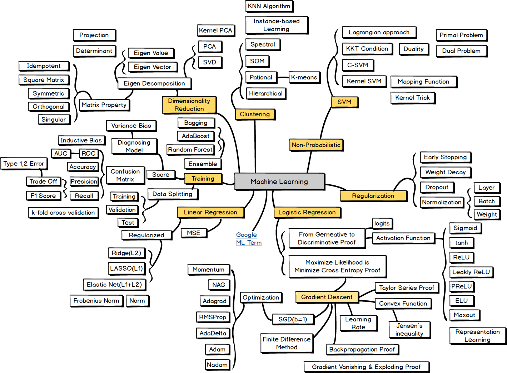
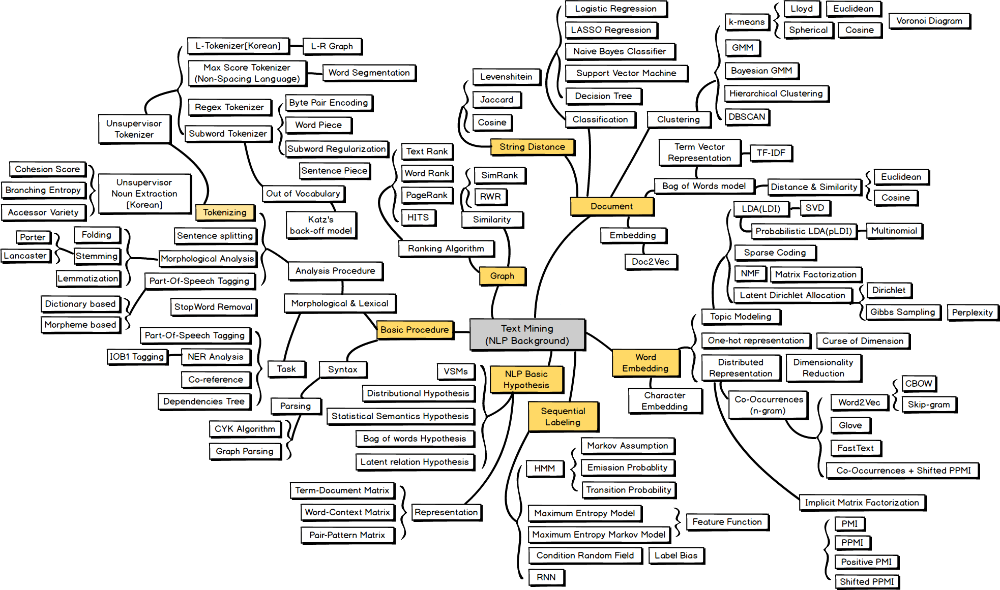
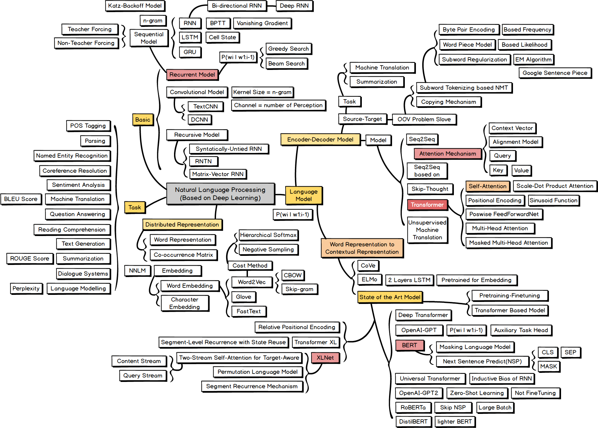

## nlp-roadmap

`nlp-roadmap` is `Natural Language Processing` **ROADMAP(Mind Map)** and **KEYWORD** for students those who have interest in learning Natural Language Processing. The roadmap covers the materials from basic probability/statistics to SOTA NLP models.

#### Caution!

- The relationship among keywords could be interpreted in ambiguous ways since they are represented in the format of a semantic mind-map. Please just focus on **KEYWORD in square box**, and deem them as the essential parts to learn.
- The work of containing a plethora of keywords and knowledge within just an image has been challenging. Thus, please note that this roadmap is one of the suggestions or ideas.

#### Curriculum

1. [Probability and Statistics](https://github.com/osDFS/nlp-roadmap#probability--statistics)

2. [Machine Learning](https://github.com/osDFS/nlp-roadmap#machine-learning)

3. [Text Mining](https://github.com/osDFS/nlp-roadmap#text-mining)

4. [Natural Language Processing](https://github.com/osDFS/nlp-roadmap#natural-language-processing)

    

## Probability & Statistics

## Machine Learning

## Text Mining

## Natural Language Processing

